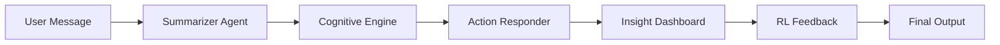

Here’s the **updated README.md** with a **pipeline flow diagram** for GitHub.

---

# SynapseCore: Remote Agent Integration Hub

SynapseCore is a **modular AI agent orchestrator** that connects multiple independent agents into a single functional pipeline.
It is designed for flexibility, modularity, and easy debugging, with support for **CLI** and **Streamlit** interfaces.

---

## 🚀 Features

* **Modular Pipeline** – Easily enable/disable agents via `pipeline_config.json`
* **Retry & Timeout Logic** – Handles failures gracefully with retries
* **Stage-wise Logging** – Each agent’s output is stored separately in `/logs`
* **Multiple Interfaces** – Run via CLI or a Streamlit web UI
* **API-first Design** – Ready for deployment as a microservice

---

## 🛠 Pipeline Flow



---

## 📂 Project Structure

```
.
├── orchestrator.py
├── message_ingest.py
├── streamlit_demo.py
├── pipeline_config.json
├── agents/
│   ├── summarizer_call.py
│   ├── cognitive_engine_call.py
│   ├── action_responder_call.py
│   ├── insight_dashboard_call.py
│   ├── rl_feedback_call.py
├── logs/
│   ├── log_summaries.json
│   ├── log_tasks.json
│   ├── log_actions.json
│   ├── log_feedback.json
│   └── final_output.json
```

---

## ⚙️ Configuration

Edit `pipeline_config.json` to toggle agents and adjust retry/timeout settings:

```json
{
  "summarizer": true,
  "cognitive_engine": true,
  "action_responder": true,
  "insight_dashboard": true,
  "rl_feedback": true,
  "retry_count": 1,
  "timeout_seconds": 10
}
```

---

## 🖥 Running from CLI

```bash
python orchestrator.py '{"user_id": "abc123", "platform": "instagram", "message_text": "Did you finalize the pitch deck?", "timestamp": "2025-08-05T13:00:00Z"}'
```

If no JSON is provided, a default test input is used.

---

## 🌐 Running Streamlit Demo

```bash
streamlit run streamlit_demo.py
```

This launches an interactive UI where you can:

* Input message details
* Toggle agents on/off (if implemented in UI)
* View final pipeline output
* Check logs in `/logs` folder

---

## 📝 Logging

Each pipeline stage produces a log file in `logs/`, storing:

* Timestamp
* Stage output data

Final merged results are saved in `logs/final_output.json`.

---

## 🔮 Future Improvements

* Add API endpoint deployment
* Implement strict timeout enforcement
* Real agent integration (replace dummy responses)
* Inline visualization of intermediate outputs in Streamlit

